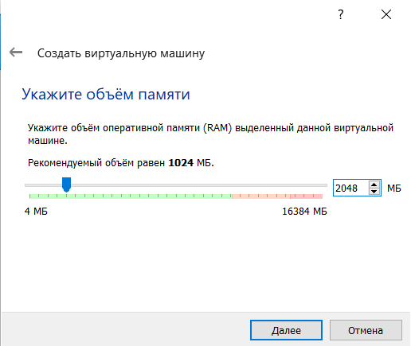
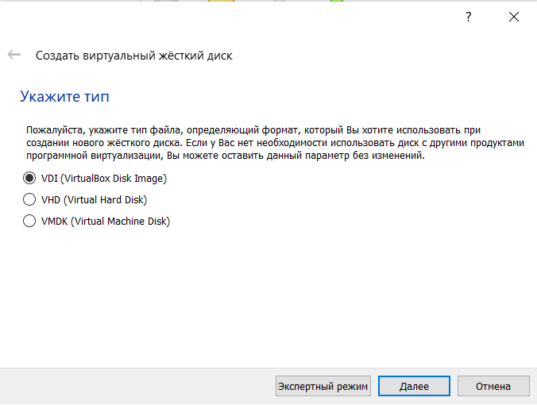
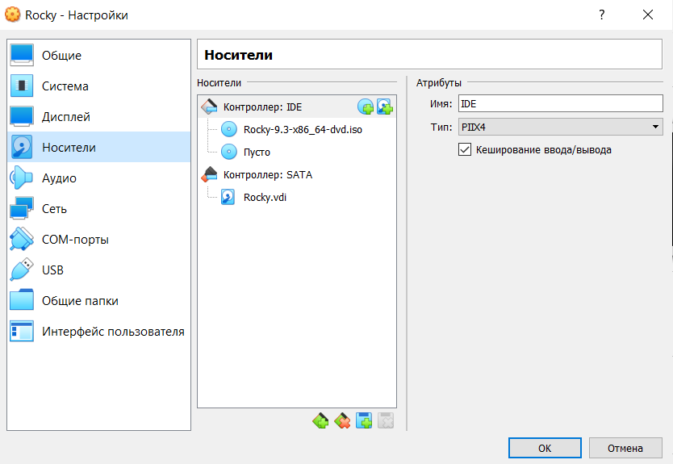
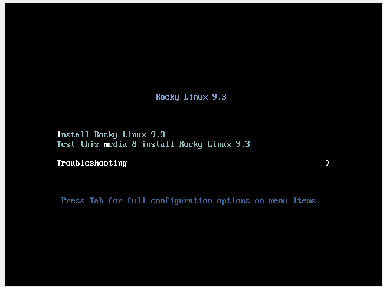
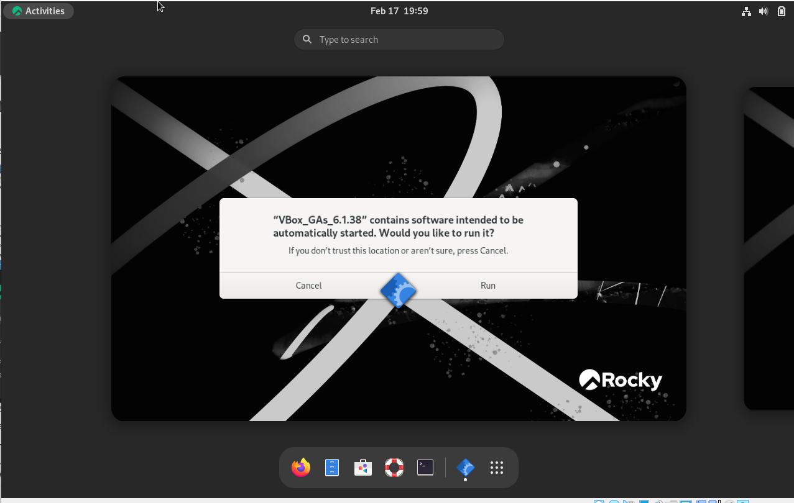
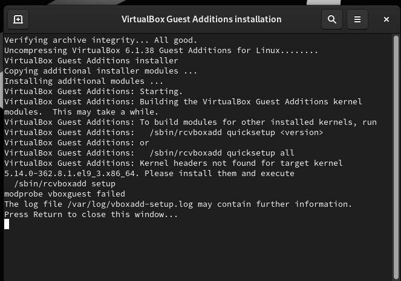
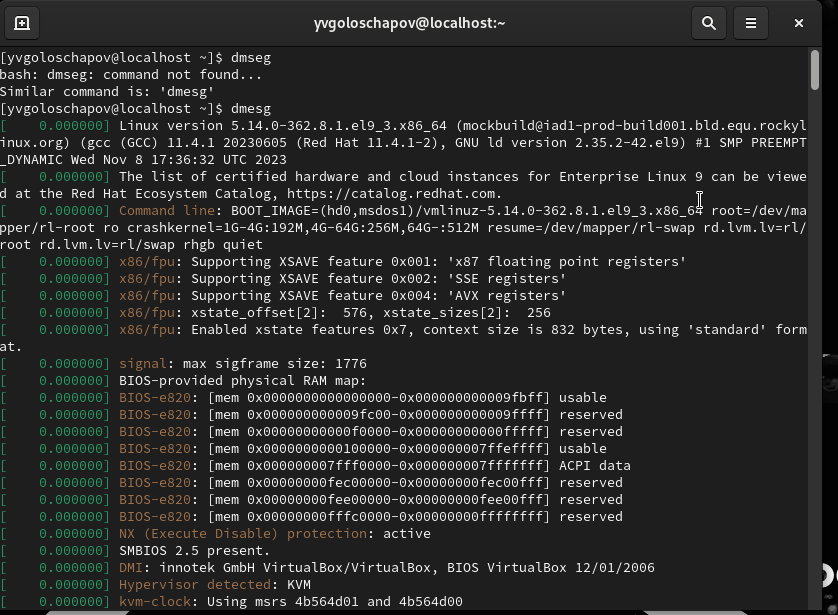
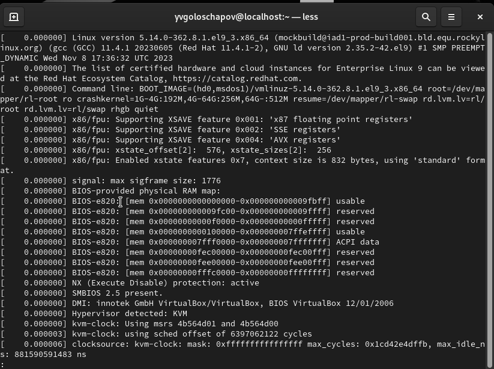

---
## Front matter
lang: ru-RU
title: Лабораторная работа №1
subtitle: Информационная безопасность
author:
  - Голощапов Я.В.
institute:
  - Российский университет дружбы народов, Москва, Россия
  - Объединённый институт ядерных исследований, Дубна, Россия
date: 01 января 1970

## i18n babel
babel-lang: russian
babel-otherlangs: english

## Formatting pdf
toc: false
toc-title: Содержание
slide_level: 2
aspectratio: 169
section-titles: true
theme: metropolis
header-includes:
 - \metroset{progressbar=frametitle,sectionpage=progressbar,numbering=fraction}
 - '\makeatletter'
 - '\beamer@ignorenonframefalse'
 - '\makeatother'
---

# Информация

## Докладчик

:::::::::::::: {.columns align=center}
::: {.column width="70%"}

  * Голощапов Ярослав Вячеславович
  * студент
  * Российский университет дружбы народов

:::
::: {.column width="30%"}

:::
::::::::::::::

# Вводная часть

## Цели и задачи

Целью данной работы является приобретение практических навыков установки операционной системы на виртуальную машину, настройки минимально необходимых для дальнейшей работы сервисов.

# Выполнение лабораторной работы 

## Настройка виртуальной машины

Поскольку у меня уже имелся Virtual Box, я перехожу к скачиванию образа ISO и одновременно с этим начинаю создание виртуальной системы. Указываю обЪем памяти (рис. [-@fig:001]).

{#fig:001 width=70%}

## Настройка диска и подключение образа

В Разделе "Виртуальный жесткий диск" создаю новый виртуальный диск объемом в 40 ГБ. После этого захожу в настройки виртуальной машины, раздел "Носители" и подключаю скачанный ранее виртуальный образ Роки (рис. [-@fig:002]), (рис. [-@fig:003]).

{#fig:002 width=70%}

{#fig:003 width=70%}

## Запуск Роки

Запускаю Роки и подключаю образ диска Дополнений
гостевой ОС (рис. [-@fig:004]), (рис. [-@fig:005]).

{#fig:004 width=70%}

{#fig:005 width=70%}

## Перезапуск машины

Подтверждаю выполнение и жду окончания загрузки, а затем снова перезапускаю машину, следуя инструкциям от системы (рис. [-@fig:006]).

{#fig:006 width=70%}

## Команда dmseg

В окне терминала анализирую последовательность загрузки системы при помощи команды dmesg (рис. [-@fig:007]).

{#fig:007 width=70%}

То же самое делаю через dmesg | less (рис. [-@fig:008]).

{#fig:008 width=70%}

# Вывод

Я приобрел практические навыки установки операционной системы на виртуальную машину, настройки минимально необходимых для дальнейшей работы сервисов.

:::

