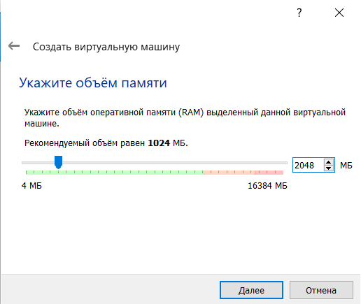
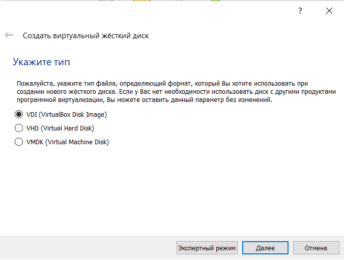
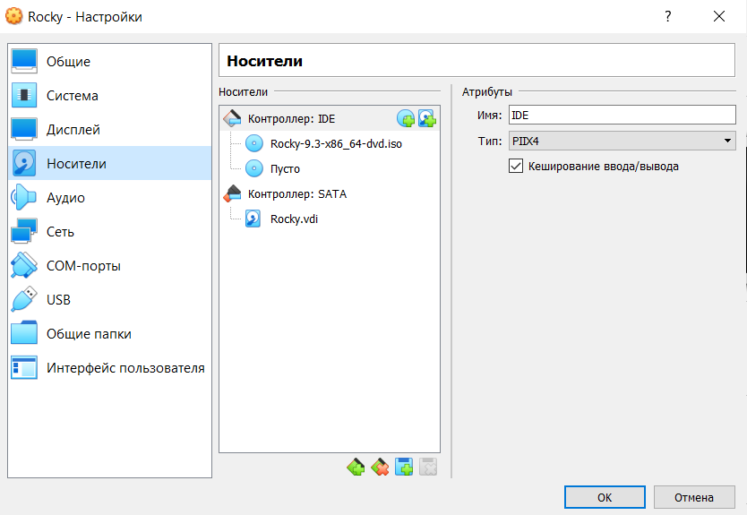
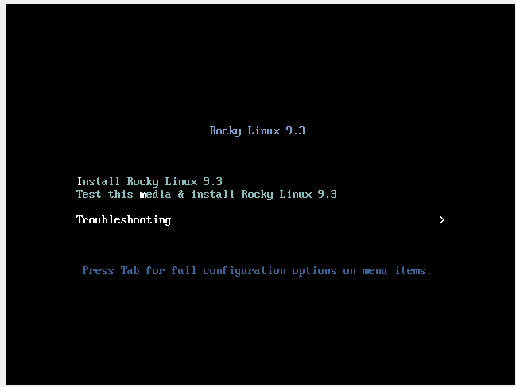
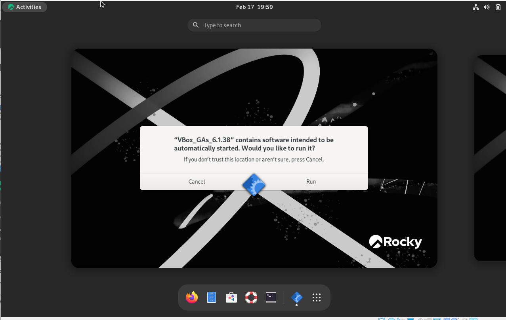
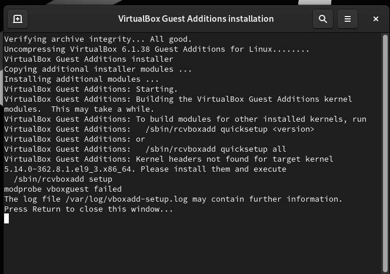
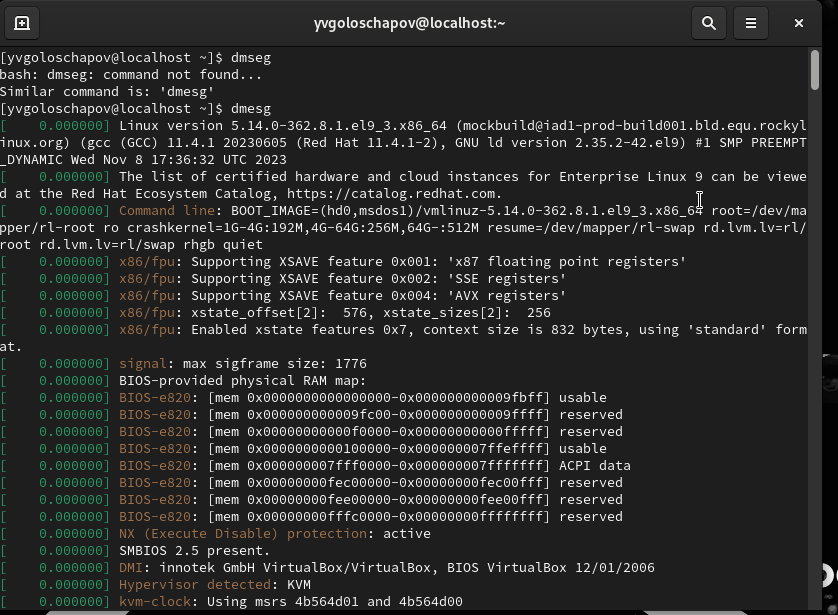
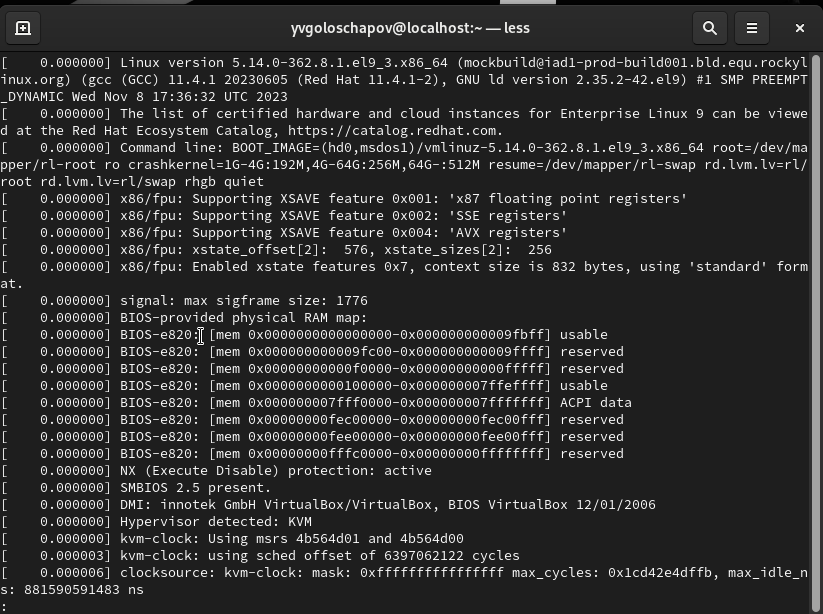

## Front matter
title: "Лабораторная работа №1"
subtitle: "Информационная безопасность"
author: "Голощапов Ярослав Вячеславович"

## Generic otions
lang: ru-RU
toc-title: "Содержание"

## Bibliography
bibliography: bib/cite.bib
csl: pandoc/csl/gost-r-7-0-5-2008-numeric.csl

## Pdf output format
toc: true # Table of contents
toc-depth: 2
lof: true # List of figures
lot: true # List of tables
fontsize: 12pt
linestretch: 1.5
papersize: a4
documentclass: scrreprt
## I18n polyglossia
polyglossia-lang:
  name: russian
  options:
	- spelling=modern
	- babelshorthands=true
polyglossia-otherlangs:
  name: english
## I18n babel
babel-lang: russian
babel-otherlangs: english
## Fonts
mainfont: PT Serif
romanfont: PT Serif
sansfont: PT Sans
monofont: PT Mono
mainfontoptions: Ligatures=TeX
romanfontoptions: Ligatures=TeX
sansfontoptions: Ligatures=TeX,Scale=MatchLowercase
monofontoptions: Scale=MatchLowercase,Scale=0.9
## Biblatex
biblatex: true
biblio-style: "gost-numeric"
biblatexoptions:
  - parentracker=true
  - backend=biber
  - hyperref=auto
  - language=auto
  - autolang=other*
  - citestyle=gost-numeric
## Pandoc-crossref LaTeX customization
figureTitle: "Рис."
tableTitle: "Таблица"
listingTitle: "Листинг"
lofTitle: "Список иллюстраций"
lotTitle: "Список таблиц"
lolTitle: "Листинги"
## Misc options
indent: true
header-includes:
  - \usepackage{indentfirst}
  - \usepackage{float} # keep figures where there are in the text
  - \floatplacement{figure}{H} # keep figures where there are in the text
---
# Цель работы
Целью данной работы является приобретение практических навыков установки операционной системы на виртуальную машину, настройки минимально необходимых для дальнейшей работы сервисов.

# Задание
Скачать необходимое ПО (Virtual Box, Rocky);
Настроить опции в соответствии с требованиями;
# Теоретическое введение
Лабораторная работа подразумевает установку на виртуальную машину VirtualBox (https://www.virtualbox.org/) операционной системы Linux (дистрибутив Rocky (https://rockylinux.org/)).

# Выполнение лабораторной работы
Поскольку у меня уже имелся Virtual Box, я перехожу к скачиванию образа ISO и одновременно с этим начинаю создание виртуальной системы. Указываю обЪем памяти (рис. [-@fig:001]).

{#fig:001 width=70%}

В Разделе "Виртуальный жесткий диск" создаю новый виртуальный диск объемом в 40 ГБ. После этого захожу в настройки виртуальной машины, раздел "Носители" и подключаю скачанный ранее виртуальный образ Роки (рис. [-@fig:002]), (рис. [-@fig:003]).

{#fig:002 width=70%}

{#fig:003 width=70%}

Запускаю Роки и подключаю образ диска Дополнений
гостевой ОС (рис. [-@fig:004]), (рис. [-@fig:005]).

{#fig:004 width=70%}

{#fig:005 width=70%}

Подтверждаю выполнение и жду окончания загрузки, а затем снова перезапускаю машину, следуя инструкциям от системы (рис. [-@fig:006]).

{#fig:006 width=70%}

В окне терминала анализирую последовательность загрузки системы при помощи команды dmesg (рис. [-@fig:007]).

{#fig:007 width=70%}

То же самое делаю через dmesg | less (рис. [-@fig:008]).

{#fig:008 width=70%}

# Контрольные вопросы
1. Какую информацию содержит учётная запись пользователя?
Учетная запись содержит данные пользователя (логин, пароль и тд), необходимые для входа в систему. 
2. Укажите команды терминала и приведите примеры:
– для получения справки по команде: help (dmesg help);
– для перемещения по файловой системе: cd (cd /work/study);
– для просмотра содержимого каталога: ls (ls work);
– для определения объёма каталога: du (du work);
– для создания / удаления каталогов / файлов: mkdir/rm/mv;
– для задания определённых прав на файл/каталог: chmod -r;
– для просмотра истории команд: клавиши вверх и вниз.
3. Что такое файловая система? Приведите примеры с краткой характериcтикой.
Файловая система - способ организации и комплектации данных в системе (/work/study/2023-2024/infosec) 
4. Как посмотреть, какие файловые системы подмонтированы в ОС? При помощи команды mount или с помощью команды df. 5. Как удалить зависший процесс? При помощи утилиты killall (останавливает все работающие процессы) или kill <>.

# Выводы
Я приобрел практические навыки установки операционной системы на виртуальную машину, настройки минимально необходимых для дальнейшей работы сервисов.

::: {#refs} :::
